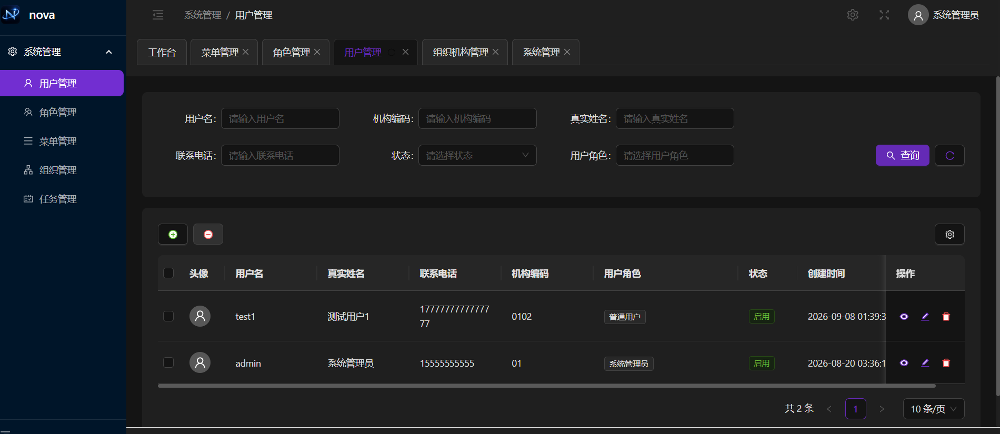
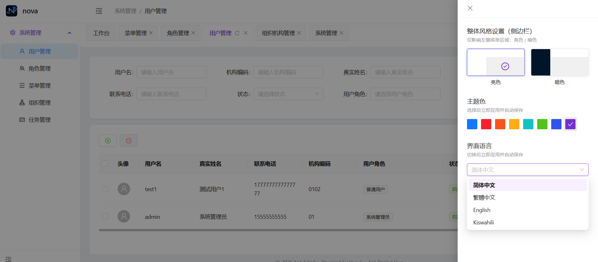

# Ant Admin - 后台管理系统

基于 Vue 3 + Vite + TypeScript + Ant Design Vue + Pinia 构建的现代化后台管理系统。

## 预览

### 登录页面


### 工作台



### 个人设置



## 技术栈

- **框架**: Vue 3
- **构建工具**: Vite
- **语言**: TypeScript
- **UI 组件库**: Ant Design Vue
- **状态管理**: Pinia
- **路由**: Vue Router
- **HTTP 客户端**: Axios
- **图标**: @ant-design/icons-vue

## 代码规范

项目集成了完整的代码规范工具，确保代码质量：

- **ESLint**: JavaScript/TypeScript 代码检查
- **Prettier**: 代码格式化
- **Stylelint**: CSS/SCSS 代码检查
- **EditorConfig**: 编辑器配置统一

### 规范工具使用

```bash
# 检查 ESLint
npm run lint:eslint

# 格式化代码（Prettier）
npm run lint:prettier

# 检查样式（Stylelint）
npm run lint:style

# 一键检查所有规范
npm run lint:all

# 格式化所有代码
npm run format
```

## 功能特性

- ✅ 用户登录/登出
- ✅ 权限管理
- ✅ 路由守卫
- ✅ 多标签页
- ✅ 面包屑导航
- ✅ 侧边栏菜单
- ✅ 用户管理
- ✅ 角色管理
- ✅ 菜单管理
- ✅ 工作台
- ✅ 个人设置
- ✅ 响应式布局

## 快速开始

### 安装依赖

```bash
npm install
```

### 开发

```bash
npm run dev
```

### 构建

```bash
npm run build
```

### 预览

```bash
npm run preview
```

## 项目结构

```
ant-admin/
├── src/
│   ├── api/           # API 接口
│   ├── assets/        # 静态资源
│   ├── components/    # 公共组件
│   ├── layouts/       # 布局组件
│   ├── router/        # 路由配置
│   ├── stores/        # 状态管理
│   ├── utils/         # 工具函数
│   ├── views/         # 页面组件
│   ├── App.vue        # 根组件
│   └── main.ts        # 入口文件
├── public/            # 公共资源
├── .eslintrc.cjs      # ESLint 配置
├── .prettierrc.cjs    # Prettier 配置
├── .stylelintrc.cjs   # Stylelint 配置
├── .editorconfig      # 编辑器配置
└── package.json
```

## 默认账号

- 用户名: admin
- 密码: admin123

## VSCode 推荐插件

项目已配置 VSCode 推荐插件，安装后自动启用：

- ESLint
- Prettier
- Stylelint
- Volar (Vue 3 支持)
- EditorConfig

## License

MIT
